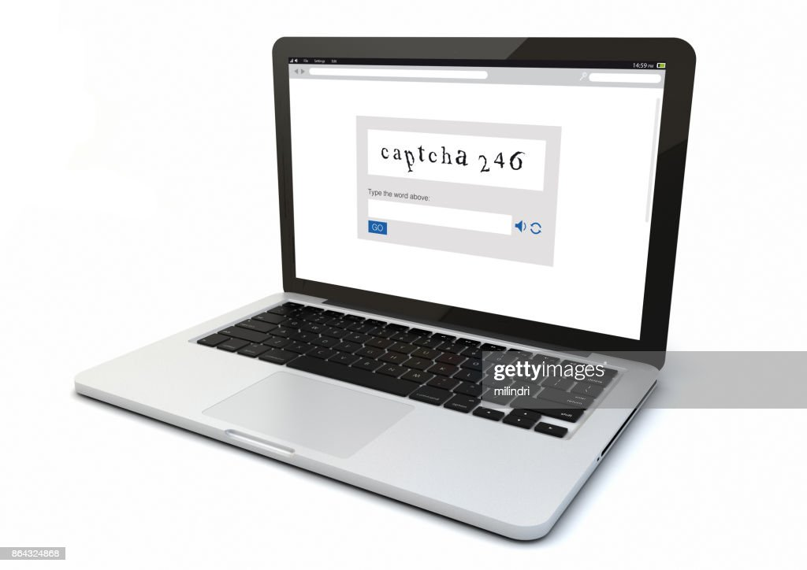

# HashTag_Reconhecimento_CAPTCHA

<div align="center">

[](https://opensource.org/licenses/MIT)

[](https://github.com/otavioaugust1/HashTag_Reconhecimento_CAPTCHA)

</div>

## Sobre o Projeto
Este projeto utiliza técnicas de visão computacional e aprendizado de máquina para reconhecer e resolver CAPTCHAs. Ele realiza o tratamento de imagens, separação de caracteres e treinamento de uma rede neural convolucional para identificar os caracteres presentes nos CAPTCHAs.

### Inspiração
Projeto inspirado nos mini vídeos e aulas da [Hashtag Programação](https://www.youtube.com/@HashtagProgramacao), que ensina Python de forma prática e didática.


## O que é o CAPTCHA?
O CAPTCHA é uma medida de segurança que protege contra spam e descriptografia de senhas. Ele consiste em um teste simples que prova que você é um ser humano, não um computador tentando invadir uma conta protegida por senha.

Um teste CAPTCHA tem duas partes simples: uma sequência de letras e/ou números gerada aleatoriamente, que aparece sob a forma de imagem distorcida, e uma caixa de texto. Para passar no teste e provar que você é um ser humano, basta digitar na caixa de texto os caracteres que você vê na imagem.



## Funcionalidades
- **Tratamento da Imagem:** Converte imagens para escala de cinza e remove o fundo, salvando o resultado na pasta de destino.
- **Separação das Letras:** Após o tratamento, separa os caracteres e os organiza em pastas específicas.
- **Treinamento da Rede Neural:** Utiliza TensorFlow para implementar uma rede neural convolucional para reconhecimento de caracteres.

## Pré-requisitos
Certifique-se de ter o Python instalado em sua máquina. As dependências do projeto estão listadas no arquivo `requirements.txt`. Para instalá-las, execute:

```bash
pip install -r requirements.txt
```

## Como Executar
1. Clone este repositório:

```bash
git clone https://github.com/otavioaugust1/HashTag_Reconhecimento_CAPTCHA.git
```

2. Navegue até o diretório do projeto:

```bash
cd HashTag_Reconhecimento_CAPTCHA
```

3. Instale as dependências:

```bash
pip install -r requirements.txt
```

4. Execute os scripts conforme necessário, por exemplo, para treinar a IA:

```bash
python Bot_treinar.py
```

## Estrutura do Projeto
```plaintext
HashTag_Reconhecimento_CAPTCHA/
├── Bot_imagem.py          # Script para tratamento de imagens
├── Bot_renomear.py        # Script para renomear arquivos
├── Bot_resolver.py        # Script para resolver CAPTCHAs
├── Bot_separar.py         # Script para separar letras das imagens
├── Bot_treinar.py         # Script para treinar a rede neural
├── helpers.py             # Funções auxiliares
├── IA_CAPTCHA.hdf5        # Modelo treinado
├── LICENSE                # Licença do projeto
├── README.md              # Documentação do projeto
├── requirements.txt       # Dependências do projeto
├── img/                   # Diretório de imagens
│   ├── base_letras/       # Base de letras para treinamento
│   ├── destino/           # Imagens tratadas
│   ├── identificado/      # Imagens identificadas
│   ├── letras/            # Letras separadas
│   ├── origem/            # Imagens originais
│   └── resolver/          # Imagens para resolver CAPTCHAs
└── navergadores/          # Scripts relacionados a navegadores
```

## 👨‍💻 Autor
- **Nome:** Otavio Augusto
- **Email:** otavioaugust@gmail.com
- **GitHub:** [@otavioaugust1](https://github.com/otavioaugust1)
- **Versão:** 0.2.1

### Funcionalidades
- ✅ Tratamento de imagens
- ✅ Separação de caracteres
- ✅ Treinamento de rede neural
- ✅ Reconhecimento de CAPTCHAs

## Contribuição
Contribuições são bem-vindas! Sinta-se à vontade para abrir issues e enviar pull requests.

## Licença
Este projeto está licenciado sob a licença MIT. Veja o arquivo `LICENSE` para mais detalhes.

